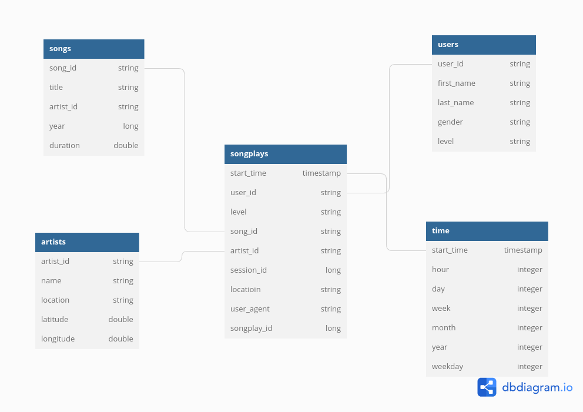

## Project: Data Lakes with PySpark 

**Project Description**: 
A music streaming company named "Sparkify" has grown their user base and song database and want to move their data from a data warehouse to a data lake. Their data resides in S3, in a directory of JSON logs on user activity on the app, as well as a directory with JSON metadata on the songs in their app. As their data engineer, I was tasked with building an ETL pipeline that extracts their data from S3, processes them using PySpark, and loads the data back into S3 as a set of dimensional tables. This will allow their analytics team to continue finding insights in what songs their users are listening to, and how can they grow their buisness.

**Choice of a Data Lake on AWS**:

There are several options when it comes to creating Data Lakes on AWS. Essentially it boils down to choosing what type of storage we want, the processing engine we want and whether we are using AWS-Managed solution or a Vendor managed solution.

In this work we have used Spark for processing Amazon Web services (AWS) Amazon Elastic MapReduce (EMR) as our managed solution, and S3 for reteriving and storing the data. S3 is a storage option which is provided by the AWS.

* **Lake Storage**: S3
* **Lake Processing**: Spark 

AWS EMR also provides the option for the Hadoop Distributed File System (HDFS) storage. But in this work S3 is used. Files are saved in the 'parquet' file format which is an open source, column-oriented data file format designed for efficient data storage and retrieval.


## Data description
There are two main datasets that reside in S3.
* **Song data**: `s3://<bucket>/song-data/`
* **Log data**: `s3://<bucket>/log-data/`

The log format is captured in `s3://<bucket>/log_json_path.json`

### Song dataset
The first dataset is a subset of real data from the Million Song Dataset. Each file is in JSON format and contains metadata about a song and the artist of that song. The files are partitioned by the first three letters of each song's track ID. For example, here are filepaths to two files in this dataset.

```
song_data/A/B/C/TRABCEI128F424C983.json
song_data/A/A/B/TRAABJL12903CDCF1A.json
```
And below is an example of what a single song file, TRAABJL12903CDCF1A.json, looks like.

```
{"num_songs": 1, "artist_id": "ARJIE2Y1187B994AB7", "artist_latitude": null, "artist_longitude": null, "artist_location": "", "artist_name": "Line Renaud", "song_id": "SOUPIRU12A6D4FA1E1", "title": "Der Kleine Dompfaff", "duration": 152.92036, "year": 0}
```

### Log dataset
The second dataset consists of log files in JSON format generated by this event simulator based on the songs in the dataset above. These simulate app activity logs from an imaginary music streaming app based on configuration settings.

The log files in the dataset you'll be working with are partitioned by year and month. For example, here are filepaths to two files in this dataset.

```
log_data/2018/11/2018-11-12-events.json
log_data/2018/11/2018-11-13-events.json
```


## Project Structure
* **etl.py**: The script reads song_data and load_data from S3, transforms them to create five different tables, and writes them to partitioned parquet files in table directories on S3.
* **dl.cfg**: Contains credentials for accessing S3.
* **etl.ipynb**: Notebook for trying things out locally before putting them into a script.
* **data**: A sample of song_data and log_data saved locally for testing before going to S3.
* **spark-warehouse**: Output tables written to parquet files. Each table has its own directory. 
    * artist table files
    * users table files
    * songs table files are partitioned by **year** and **artist**. 
    * time table files are partitioned by **year** and **month**. 
    * songplays table is partitioned by **year** and **month**.

## Methodology
`etl.py` script makes use of PySpark to wrangling the data. It starts off by reading song_data and load_data from S3, transforms them to create five different tables, and writes them to partitioned parquet files in table directories on S3. 

A simple star schema was employed for designing the tables.
<p align="middle">
  
    
### Terminal commands
- You can install the requirements in the `requirements.txt` by using:
    ```
    $ pip install -r requirements.txt
    ```
    
- Execute the ETL pipeline script by running:
    ```
    $ python etl.py
    ```

## Example Results
    

songs_table: 

|      song_id       |           title            |     artist_id      | year |  duration |
|--------------------|----------------------------|--------------------|------|-----------|
| SOGOSOV12AF72A285E |     ¿Dónde va Chichi?      | ARGUVEV1187B98BA17 | 1997 | 313.12934 |
| SOMZWCG12A8C13C480 |      I Didn't Mean To      | ARD7TVE1187B99BFB1 |  0   | 218.93179 |
| SOUPIRU12A6D4FA1E1 |    Der Kleine Dompfaff     | ARJIE2Y1187B994AB7 |  0   | 152.92036 |
| SOXVLOJ12AB0189215 |      Amor De Cabaret       | ARKRRTF1187B9984DA |  0   | 177.47546 |
| SOWTBJW12AC468AC6E | Broken-Down Merry-Go-Round | ARQGYP71187FB44566 |  0   | 151.84934 |

artists_table: 

|     artist_id      |             name             |         location        | lattitude | longitude |
|--------------------|------------------------------|-------------------------|-----------|-----------|
| AR9AWNF1187B9AB0B4 | Kenny G featuring Daryl Hall | Seattle, Washington USA |    nan    |    nan    |
| AR0IAWL1187B9A96D0 |         Danilo Perez         |          Panama         |   8.4177  | -80.11278 |
| AR0RCMP1187FB3F427 |       Billie Jo Spears       |       Beaumont, TX      |  30.08615 | -94.10158 |
| AREDL271187FB40F44 |         Soul Mekanik         |                         |    nan    |    nan    |
| ARI3BMM1187FB4255E |         Alice Stuart         |        Washington       |  38.8991  |  -77.029  |

users_table: 

| user_id | first_name | last_name | gender | level |
|---------|------------|-----------|--------|-------|
|    51   |    Maia    |   Burke   |   F    |  free |
|    7    |   Adelyn   |   Jordan  |   F    |  free |
|    15   |    Lily    |    Koch   |   F    |  paid |
|    54   |   Kaleb    |    Cook   |   M    |  free |
|   101   |   Jayden   |    Fox    |   M    |  free |

time_table: 

|         start_time         | hour | day | week | month | year | weekday |
|----------------------------|------|-----|------|-------|------|---------|
| 2018-11-21 06:18:12.796000 |  6   |  21 |  47  |   11  | 2018 |    4    |
| 2018-11-14 15:20:15.796000 |  15  |  14 |  46  |   11  | 2018 |    4    |
| 2018-11-05 16:31:59.796000 |  16  |  5  |  45  |   11  | 2018 |    2    |
| 2018-11-13 18:00:26.796000 |  18  |  13 |  46  |   11  | 2018 |    3    |
| 2018-11-30 04:32:02.796000 |  4   |  30 |  48  |   11  | 2018 |    6    |

songplays_table: 

|         start_time         | user_id | level |      song_id       |     artist_id      | session_id |             locatioin              |                                                                 user_agent                                                                | songplay_id |
|----------------------------|---------|-------|--------------------|--------------------|------------|------------------------------------|-------------------------------------------------------------------------------------------------------------------------------------------|-------------|
| 2018-11-21 21:56:47.796000 |    15   |  paid | SOZCTXZ12AB0182364 | AR5KOSW1187FB35FF4 |    818     | Chicago-Naperville-Elgin, IL-IN-WI | "Mozilla/5.0 (X11; Linux x86_64) AppleWebKit/537.36 (KHTML, like Gecko) Ubuntu Chromium/36.0.1985.125 Chrome/36.0.1985.125 Safari/537.36" |      0      |


